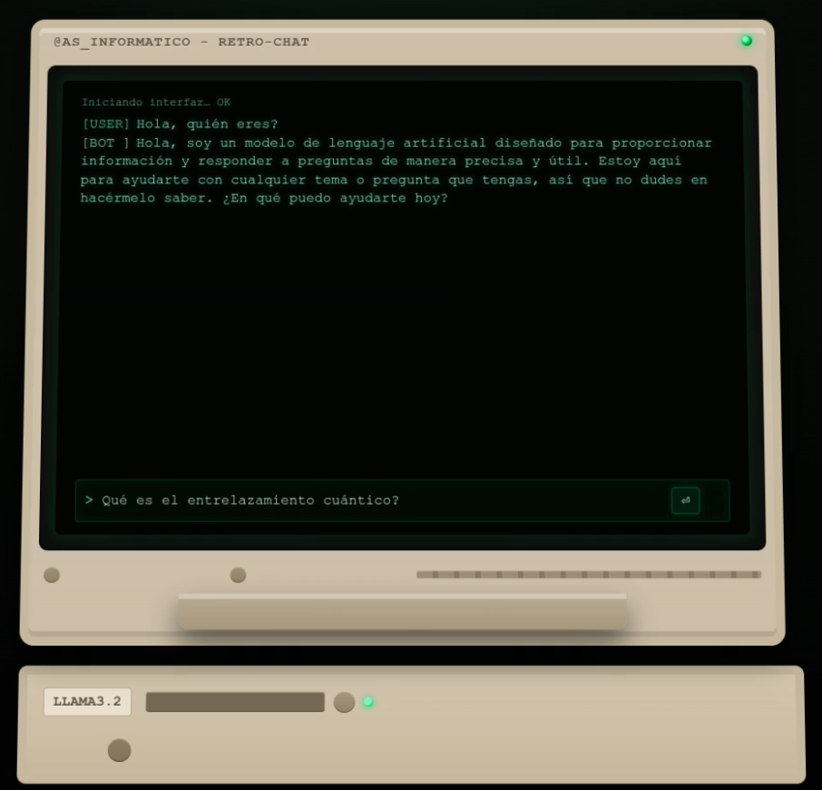

<h1>Agente de IA local con frontend web de estilo retro</h1>

En este repositorio voy a explicar cómo montar un agente de IA (con funciones de especialización) utilizando un modelo local RAG (búsqueda semántica), listo para que los usuarios hagan preguntas técnicas o de cualquier índole.

Vamos a ver paso a paso como preparar el equipo, el entorno, el motor de IA, los modelos, la base de conocimiento especializado, el backend con los scripts de chat con búsqueda (RAG) y el frontend, un cliente de chat web al más puro estilo ochentero.



Este proyecto puede utilizarse tanto en sistemas Windows como GNU/Linux, varía muy poco y tan solo en algunos comandos de configuración e instalación (evidentemente). Como yo soy usuario de Linux desde que me acanza la memoria, este tutorial paso a paso está realizado tal como lo he seguido en mi sistema operativo Linux Mint. Si utilizas cualquier otra distro de Linux te será muy fácil seguirlo, si eres usuario de Windows ¿a tí qué te pasa?, te será un poco menos fácil XDD.

Yo he utilizado para correrlo un equipo portátil no muy moderno (de hace unos 6 años) con procesador Intel i7 de 8ª generación, 32Gb de RAM y disco SSD NVMe. Y con GPU Nvidia MX250 que no me ha servido de nada ya que no es compatible con las librerías utilizadas en el desarrollo. Eso no es problema ya que he preparado el backend para que por defecto tire de GPU y en caso de no disponer de una GPU compatible, tirar solamente de CPU. En mi caso he hecho todas las pruebas utilizando solo la CPU y el resultado ha sido más que aceptable, podéis verlo en el vídeo adjunto.

Ver Vídeo: <a href="https://github.com/asinformatico/IA_local_retro/blob/main/retro-term-ia.mp4">Clic aquí</a>

<h2>Estructura del Proyecto:</h2>

/Proyecto_IA_retro/         # carpeta raiz del proyecto

├─── docs_app/ # carpeta donde guardaremos los .txt de especialización

├─── logs/ # carpeta de logs de las conversaciones

|              ├─── conversaciones.log

|

├─── vectorstore/

├─── static/ # carpeta con los archivos del frontend

|              ├─── index.html

|              ├─── script.js

|              ├─── styles.css

|

├─── chat_app_ollama.py

├─── readme.txt

├─── requirements.txt

├─── server_final.py

├─── watcher_docs.py

<h2>Preparar el sistema:</h2>

En primer lugar debemos elegir un modelo de IA local, lo ideal es decantarse por modelos ligeros (menos de 13B de parámetros) a menos que dispongamos de una GPU potente con la que podríamos usar modelos de 30B de parámetros o más. Las que yo he probado con buenos resultados y buen rendimiento sin tirar de GPU son estas:

- llama3.2            2.0GB
  
- codellama         3.8GB
  
- mistral               4.4GB
  
- deepseek-r1     4.7GB
  
- gpt-oss            13.0GB
  

Hay muchas más que podéis probar con diferentes caraterísticas y entrenamiento, como gemma3, qwen3, llava, phi3, etc. Podéis verlas en la web de ollama: [Ollama Search](https://ollama.com/search)

Vamos ya con la terminal. Accedemos a la carpeta del proyecto y empezamos.

```bash
cd Proyecto_IA_Retro
```

Lo primero va a ser actualizar el sistema e instalar unas cosillas...

```bash
sudo apt-get update && sudo apt-get upgrade -y
```

Instalamos unas cosillas, Pyhton por supuesto (es raaro que no lo tengas ya instalado) y creamos un entorno virtual (deberíais acostumbraros a hacer esto siempre por salud mental XDD)

```bash
sudo apt-get install git curl python3-pip build-essential -y
sudo apt install python3-venv -y
python3 -m venv ai_env
source ai_env/bin/activate
```

Lo siguiente, descargamos e instalamos ollama y al menos un modelo, en este tutorial voy a utilizar el modelo llama3.2

```bash
curl -fsSL https://ollama.com/install.sh | sh
```

Para instalar un modelo podemos utilizar directamente el parámetro run, si el modelo existe en el sistema, se carga y podremos utilizarlo directamente desde la terminal, en caso contrario, se descarga automáticamente y una vez finalizada la descarga se instala y arranca igualmente.

```bash
ollama run llama3.2
```

Seguro que tras arrancar le has hecho algunas preguntas para probarlo. Para cerrar el prompt de la IA y volver a bash, tan solo escribe /bye y pulsa la tecla enter. Si utilizas /? podrás ver las diferentes opciones (y son muchas) que tienes disponibles directamente sobre el modelo.

Ya de vuelta a la línea de comandos, instalamos las librerías necesarias para que el proyecto funcione.

```bash
pip install -r requirements.txt
```

Se instalar todas aquellas librerías especificadas en el documento de texto requirements.txt que ya os dejo listo en el repo.

Con esto ya tenemos todo listo para personalizar los archivos del proyecto y arrancarlo. Ya tienes una IA local funcionando en tu sistema, totalmente operativa, privada y off-line. ¿A que ha sido pan comido?

<h2>Preparando el backend</h2>

Los archivos tal como están en el repo vienen preconfigurados para usar el modelo llama3.2, puedes usar cualquier otro modificando el valor de la variable correspondiente al modelo, en el archivo chat_app_ollama.py es la variable MODEL que puedesz encontar en la línea 13 del archivo (por convención en Python las variables cuyo nombre es completamente en mayúsculas debe tratarse como una constante). en el archivo server_final.py es la variable model en la línea 38.

En ambos archivos veréis que hay una función definida para las preguntas con una variable llamada prompt, en esta variable es donde podéis definir un promt específico que se sumará a la consulta que hagamos desde el interface web. Por ejemplo, podemos defeinir en este prompt que "siempre responda en español, que tome como prioridad para las respuestas los archivos pasados en la carpeta docs_app/ y que adquiera el rol de expeto en desarrollo web y no responda nada que no tenga que ver con el desarrollo web". Con esto nos aseguramos que pregunte lo que pregunte un usuario desde el cliente siempre responderá bajo los parámetros que le hemos indicado. Por supuesto podemos pasarle lo que queramos en incluso no decirle nada y que se comporte tal como por defecto se ha preparado el modelo de "fábrica".

<h2>Ejecutando el servicio</h2>

Pues con esto ya podemos ejecutar los servicios necesarios para que el cliente pueda estar operativo y accesible desde nuestro navegador web.

En primer lugar ejecutamos el archivo watcher_docs.py, este actualiza los vectores en función de los archivos encontrados en la carpeta docs_app y si lo dejamos en marcha, los actualizará automáticamente cada vez que detecte cambios en dicha carpeta (añadimos, quitamos o modificamos un archivo). no ocurre nada si cerramos este proceso tras la primera actualización, tan solo debermos ejecutarlo manualmente cada vez que hagamos cambios en los archivos de especialización.

```bash
python3 watcher_docs.py
```

Estos archivos de especialización deben contener datos de referencia que el modelo pueda consultar. Por ejemplo:

- Manual de usuario de nuestra App.
  
- Lista de preguntas frecuentes (FAQ) de soporte.
  
- Fragmentos de código o descripción de funciones clave.
  
- Logs de incidencias y soluciones.
  

O cualquier otra cosa que en la que deseemos que la IA responda como deseemos.

Es recomendable estructurar los datos en un formato fácil de consultar, como:

- JSON: `{ "pregunta": "...", "respuesta": "..." }`
  
- Markdown: cada sección de la documentación como archivo independiente.
  
- Base de datos vectorial (Vector DB) para búsquedas semánticas.
  

Lo siguiente ya es ejecutar el archivo que arranca el servicio web.

```bash
python3 server_final.py
```

una vez arrancado ya podemos abrir nuestro navegador web favorito y acceder a la dirección local en el puerto indicado, por defecto el 8000, el indicado en nuestro código, en caso de estar utilizándolo en algún otro servicio, podemos cambiarlo editanto el archivo server_final.py.

<a href="http://localhost:8000">http://localhost:8000</a>

Podremos ver como se carga un fábuloso ordenador retro con pantalla de fósforo verde en el que podremos hacer nuestras preguntas a la IA desde una interface más que molona. La pantalla tiene scroll, pero podemos borrar los datos de la misma mandando el comando clear como si fuera una pregunta más en el chat. Le he incorporado el típico sonido de bip bip en cada ppusalción de teclas que hagamos para que la inmersión retro sea más impactante.

Y esto es todo, ahora a disfrutar haciendo preguntas a tu IA ;)

**Atte. Jesús Pacheco aka @as_informatico
